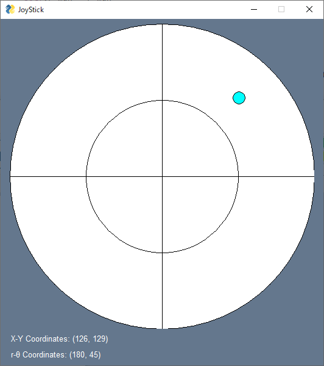
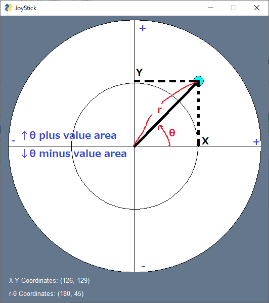

# GUI_JoyStick
Simple GUI JoyStick using PySimpleGUI.

# How To Use
Make sure you have installed PySimpleGUI in your Python3.
### To Try and Check JoyStick
To check, simply run `python GUI_JoyStick.py`  
You will see this window;  
  
The JoyStick Pad, shown as cyan circle, will stick to your mouse pointer on left click-down, 
and back to center on left click-up.  
The coordinates at lower left side are written in (X [pxls], Y [pxls]) and (r [pxls], theta [deg]) formats.

### To Use In Your Code
To use coordinates in your own code, do like following;  
```
import GUI_JoyStick

js = GUI_JoyStick.JoyStick()

while True:
    js.update()
    print(js.xy_coordinates)
    print(js.rt_coordinates)
    
    if js.close:
        break
```
In this case, `js.xy_coordinates` has (X [pxls], Y [pxls]) data, and `js.rt_coordinates` has (r [pxls], theta [rad]) data, 
while GUI shows (X [pxls], Y [pxls]) and (r [pxls], theta [deg]).  
It's possible to change circle size and pad size, on set `js = GUI_JoyStick.JoyStick(r_max=[YourCircleSize], stick_size=[YourPadSize])`
### How values are set
The origin to calculate coordinates are at the cross point of horizontal and vertical lines shown in UI.  
The coordinates values are taken as shown in below;  

# Example
This is an example to generate a cmd to control 2 wheels, left and right wheels, vehicle.  
To do this, we need to tell directions and powers to apply for both wheels.  
Run below to check how it works;  
```
python ./example/ControlCrawlerMotor.py
```

# HELP WANTED
I need your support, pls feed me.  
<a href="https://www.buymeacoffee.com/aiueoabc" target="_blank"></a>
